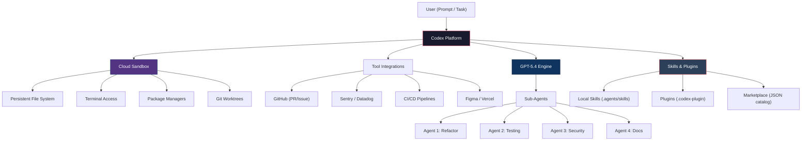
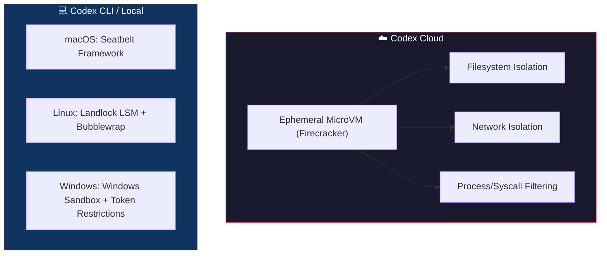
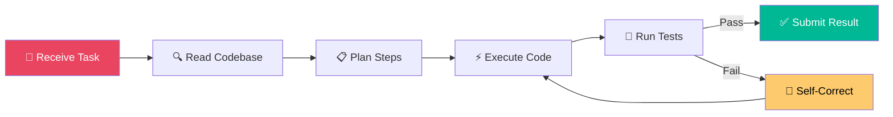
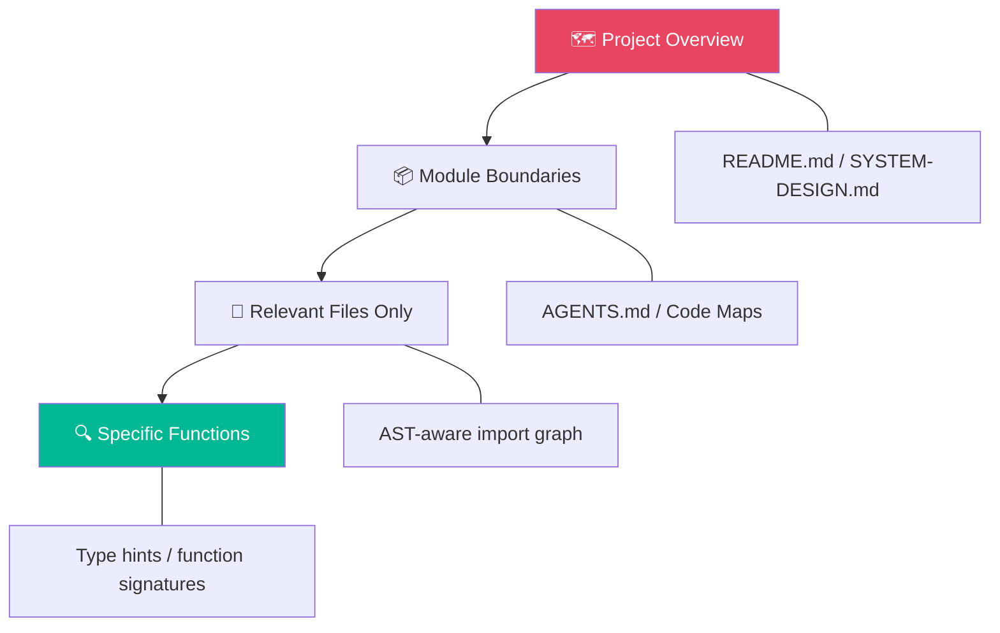
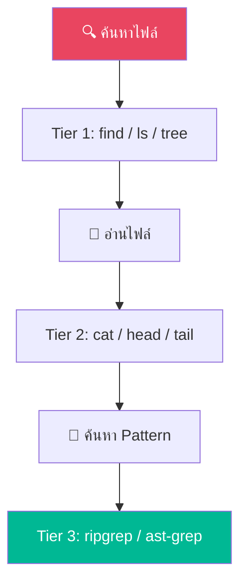
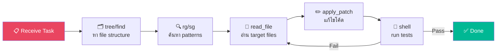
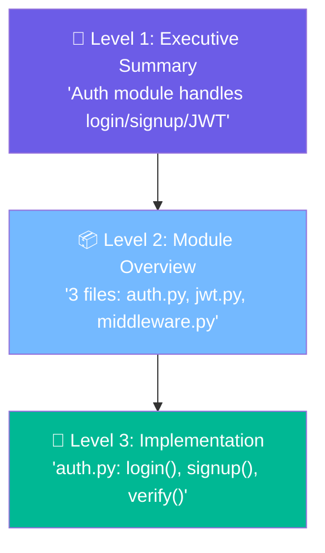
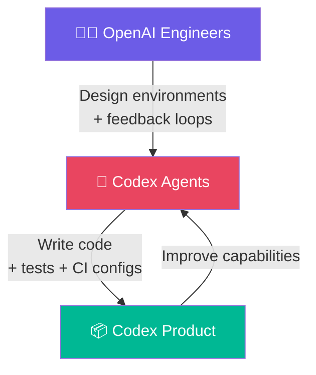
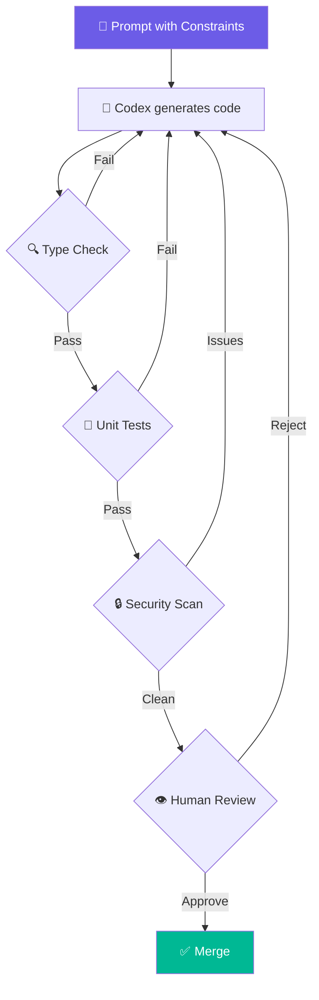

# 🔬 OpenAI Codex (GPT-5.4) — วิจัยพฤติกรรมการเขียนโค้ด [Deep Dive]

> **วันที่วิจัย**: 7 เม.ย. 2026  
> **Model Version**: GPT-5.4 (มีนาคม 2026) — สืบทอดจาก GPT-5.3-Codex  
> **สถานะ**: Codex = **Agentic Software Engineering Platform** เต็มรูปแบบ  
> **Desktop App**: เปิดตัว 2 ก.พ. 2026 (macOS หลัก, Windows มาทีหลัง)

---

## 1. สถาปัตยกรรมระบบ (System Architecture)



| Component | รายละเอียด |
|:---|:---|
| **Core Engine** | GPT-5.4 — optimized สำหรับ agentic coding, native computer-use, ลด token overhead 47% |
| **Sandbox** | Cloud-isolated environment — มี file system, terminal, npm/pip ของตัวเอง |
| **Context Window** | สูงสุด 1M tokens — ใช้ hierarchical context loading + context compaction |
| **Sub-Agents** | Spawn parallel agents สำหรับ task ต่างๆ พร้อมกันได้ |
| **Trigger System** | Auto-respond ต่อ GitHub issue, PR, CI failure events |
| **Desktop App** | Command center สำหรับ multi-agent orchestration (macOS/Windows) |
| **Git Worktrees** | แต่ละ agent ทำงานใน Git worktree แยก — ไม่ conflict กัน |

---

## 2. Sandbox Architecture — ลึกขึ้น (Under the Hood)

> [!IMPORTANT]
> Sandbox คือแก่นของ Codex ที่ต่างจาก AI coding tools อื่นๆ ทั้งหมด — มันไม่ได้แค่ generate code แต่ **execute จริง** ใน environment ที่ isolated

### 2.1 Multi-Layer Sandboxing



| Layer | วิธีการ | จุดประสงค์ |
|:---|:---|:---|
| **Filesystem** | จำกัด access เฉพาะ workspace/repo — ไม่เห็น host filesystem | ป้องกัน data leak |
| **Network** | Default offline, สามารถ allowlist endpoints ได้ | ป้องกัน exfiltration |
| **Process** | seccomp syscall filtering + reduced privileges | ป้องกัน privilege escalation |
| **MicroVM** | Firecracker-based — kernel แยก (ไม่ใช่แค่ container) | Hardware-level isolation |

### 2.2 Two-Layer Control

| ชั้น | หน้าที่ |
|:---|:---|
| **Sandbox (Technical)** | กำหนดว่า agent ทำอะไร **ได้/ไม่ได้** ทางกายภาพ |
| **Approval Policy (Human)** | กำหนดว่า agent ต้อง **ขอถาม** ก่อนทำอะไร |

---

## 3. พฤติกรรมการเขียนโค้ด (Coding Behavior)

### 3.1 Workflow Pattern



### 3.2 รูปแบบโค้ดที่สร้างออกมา

| ด้าน | พฤติกรรมของ Codex |
|:---|:---|
| **Naming** | Semantic, descriptive — อ่านเหมือนภาษาอังกฤษ |
| **Architecture** | ชอบ modular, single-responsibility — แยก file เล็กๆ |
| **Error Handling** | Explicit try-catch, ไม่ปล่อย silent failure, ใส่ structured logging |
| **Type System** | ใส่ type hints/interfaces ค่อนข้างดี |
| **Guard Clauses** | ชอบ return early pattern — ลด nesting |
| **Testing** | สร้าง test พร้อมโค้ดได้ แล้ว run จนผ่าน (self-healing loop) |
| **Comment** | ใส่ inline comment สำหรับ non-obvious logic |
| **DRY** | ⚠️ มี tendency ที่จะ duplicate logic ถ้าไม่ constrain ดี |

### 3.3 Approval Modes (ระดับความอิสระ)

| Mode | พฤติกรรม | เหมาะกับ |
|:---|:---|:---|
| **Suggest** (Default) | ต้องอนุมัติทุก action | งานที่ sensitive / production |
| **Auto-Edit** | แก้ไฟล์อัตโนมัติ แต่ขอ approve สำหรับ shell commands | งานทั่วไป |
| **Full-Auto** | ทำทุกอย่างเอง ไม่ถาม | CI/CD, isolated tasks |

---

## 4. ⚠️ Code Smells & Anti-Patterns ที่ Developer รายงาน

> [!CAUTION]
> ข้อมูลจาก Reddit communities และ developer reviews — เป็นปัญหาที่พบบ่อยเมื่อใช้ Codex **โดยไม่มี strict guidance**

### 4.1 Common Code Smells

| Anti-Pattern | คำอธิบาย | ความรุนแรง |
|:---|:---|:---|
| **Broken Abstractions** | สร้าง interface สวย แต่ไป reference concrete types ทั่วโค้ด — abstraction ไร้ค่า | 🔴 สูง |
| **Massive Code Duplication** | ไม่ apply DRY — ซ้ำ logic ข้าม classes แทนที่จะ abstract | 🔴 สูง |
| **Over-Engineering** | ใช้ solution ซับซ้อนเกินจำเป็น — สร้าง DB table ใหม่ทั้งที่แค่ frontend task | 🟡 กลาง |
| **SOLID Violations** | ไม่ยึด single-responsibility, open/closed — ได้ spaghetti | 🟡 กลาง |
| **Excessive Verbosity** | สร้าง boilerplate มหาศาล — ซ่อน logic จริงๆ | 🟡 กลาง |
| **"Vibe Coding"** | Dev ไม่ review output — กด accept ไวจน integrate buggy code | 🔴 สูง |
| **Context Dilution** | ใช้ thread เดียวทำหลาย task — model performance ตก | 🟡 กลาง |
| **Security Gaps** | ไม่ validate input, hardcode credentials, risky subprocess calls | 🔴 สูง |

### 4.2 Root Cause Analysis

```mermaid
fishbone-diagram
    title "ทำไม Codex สร้าง Code Smells"
    
    "Prompt" : "กำกวม / ไม่มี constraints"
    "Prompt" : "ไม่ระบุ architecture pattern"
    "Context" : "Thread ยาวเกิน / ปนหลาย task"
    "Context" : "ไม่มี AGENTS.md"
    "Human" : "ไม่ review output"
    "Human" : "ปล่อยให้ agent ตัดสินใจ design"
    "Model" : "Overly literal"
    "Model" : "ชอบ over-engineer"
```

### 4.3 วิธีป้องกัน (Mitigation)

| กลยุทธ์ | รายละเอียด |
|:---|:---|
| **AGENTS.md** | ใส่ design principles, anti-patterns ที่ห้ามทำ, coding standards |
| **Granular Prompts** | แยก task เล็กๆ + ระบุ constraints ชัด |
| **Mandatory Testing** | Treat output เป็น draft — ต้องผ่าน lint + unit test เหมือนคนเขียน |
| **Session Hygiene** | เริ่ม session ใหม่สำหรับแต่ละ task — ไม่ปนกัน |
| **Explicit Checklists** | ให้ agent verify ตาม spec ก่อน declare "done" |
| **Few-Shot Examples** | ใส่ตัวอย่าง pattern ที่ต้องการลงใน prompt |

---

## 5. Context Management Strategy

### 5.1 Hierarchical Context Loading



| Strategy | คำอธิบาย |
|:---|:---|
| **Code Maps** | ใช้ high-level docs (README, SYSTEM-DESIGN) สำหรับ overview |
| **AST-Based Navigation** | ดึงเฉพาะ file ที่ import graph ชี้ — ไม่ load ทั้ง repo |
| **Context Compaction** | ใช้ `compact_threshold` ใน API ให้ prune history อัตโนมัติ |
| **State Persistence** | เขียน NOTES.md/todo.md ให้ agent อัปเดตระหว่างทำ |
| **Clear & Reset** | Clear context ระหว่าง phase (research → implement → review) |
| **Sub-Agent Scoping** | Coordinator agent จัดการ plan + sub-agents ทำ focused tasks |

---

## 6. Skills & Plugins System

### 6.1 Skills (หน่วยย่อยของ capability)

```
project-root/
├── .agents/
│   └── skills/
│       ├── deploy-staging/
│       │   ├── SKILL.md          ← Instructions
│       │   └── scripts/
│       │       └── deploy.sh
│       └── generate-docs/
│           └── SKILL.md
```

- **Local Skills**: วางไว้ใน `.agents/skills/` ของ repo
- Codex scan directory นี้อัตโนมัติ
- ใช้ natural language + scripts สำหรับ deterministic tasks

### 6.2 Plugins (หน่วยแจกจ่าย)

```
.codex-plugin/
├── plugin.json              ← Manifest (name, version, author)
├── skills/                  ← Bundled skills
├── mcp-servers/             ← MCP server configs
└── app-integrations/        ← Slack, Notion, GitHub configs
```

- สร้างด้วย `$plugin-creator` skill ใน Codex
- แชร์ผ่าน marketplace (JSON catalog)
- Enterprise สามารถ push/block plugins ได้

### 6.3 Automations & Triggers

| Trigger | ตัวอย่าง |
|:---|:---|
| **GitHub Push** | Auto-run tests + lint |
| **New Issue** | Auto-triage + propose fix |
| **PR Opened** | Auto-review + security scan |
| **CI Failure** | Auto-analyze + suggest fix |
| **Scheduled** | Background documentation updates |

---

## 7. Codex Security Agent

> [!NOTE]
> นี่คือ feature ที่น่าสนใจมากสำหรับปิ๊ก — AI ทำ security review ให้อัตโนมัติ

### 7.1 Pipeline


| Stage | รายละเอียด |
|:---|:---|
| **Context Building** | วิเคราะห์ codebase + commit history → สร้าง threat model |
| **Threat Model** | Map attacker entry points, trust boundaries, sensitive data (แก้ไขได้) |
| **Discovery** | Scan ด้วย reasoning — ไม่ใช่แค่ pattern matching แบบ SAST เดิม |
| **Validation** | ทำ PoC ใน sandbox — ลด false positive ลงมหาศาล |
| **Remediation** | เสนอ minimal patch — ไม่ auto-merge ต้อง human review |

### 7.2 ต่างจาก SAST เดิมยังไง

| ด้าน | Traditional SAST | Codex Security |
|:---|:---|:---|
| **Approach** | Pattern matching | LLM reasoning + context |
| **False Positives** | เยอะมาก | ลดเยอะ (sandbox validation) |
| **Context** | ไม่เข้าใจ business logic | เข้าใจ project-specific context |
| **Output** | Generic warnings | Validated findings + PoC + patch |

---

## 8. Pricing Comparison (API-level)

> [!TIP]
> ราคาต่อ 1M tokens — ใช้เปรียบเทียบ cost ของ agentic workflows

### 8.1 OpenAI Models

| Model | Input | Cached Input | Output |
|:---|:---|:---|:---|
| **GPT-5.4** | $2.50 | $0.25 | $15.00 |
| **GPT-5.4 mini** | $0.75 | $0.08 | $4.50 |
| **GPT-5.4 nano** | $0.20 | $0.02 | $1.25 |

### 8.2 Anthropic Models (Claude Code)

| Model | Input | Output |
|:---|:---|:---|
| **Claude Opus 4.6** | $5.00 | $25.00 |
| **Claude Sonnet 4.6** | $3.00 | $15.00 |
| **Claude Haiku 3.5** | $0.80 | $4.00 |

### 8.3 Cost Strategy

| Strategy | รายละเอียด |
|:---|:---|
| **Prompt Caching** | ลดราคา input 90% สำหรับ repeated context (AGENTS.md, file schemas) |
| **Model Tiering** | ใช้ mini/nano สำหรับ routine tasks, flagship สำหรับ complex tasks |
| **Reasoning Effort** | ลด thinking budget สำหรับ simple tasks = ลด token ลง |
| **Subscription** | Codex-only seats สำหรับ enterprise = fixed cost |

---

## 9. Desktop App Features

| Feature | รายละเอียด |
|:---|:---|
| **Multi-Agent Dashboard** | Manage agents หลายตัวพร้อมกัน — แต่ละตัวทำ task ต่างกัน |
| **Git Worktree per Agent** | แต่ละ agent ใช้ worktree แยก — ไม่ conflict กัน |
| **Inline Diff Review** | ดู changes ก่อน merge แบบ side-by-side |
| **Skills & Automations** | Config skills + set background automations |
| **Progress Monitoring** | ดูสถานะ agent แบบ real-time |
| **CLI Integration** | สลับระหว่าง App ↔ CLI ↔ VS Code ได้ seamless |

---

## 10. เปรียบเทียบกับ AI Coding Agents อื่น (ขยาย)

| Feature | Cursor | Claude Code | OpenAI Codex | GitHub Copilot |
|:---|:---|:---|:---|:---|
| **Paradigm** | AI-Native IDE | Terminal-First Agent | Cloud-Based Agent | IDE Assistant |
| **Workflow** | Interactive, real-time | Terminal, task-driven | Async, fire-and-forget | Inline suggestions |
| **Best For** | Daily coding, UI work | Complex multi-file refactors | Background autonomous tasks | Quick completions |
| **Key Strength** | IDE integration, visual | Deep reasoning, context | Ecosystem, parallel agents | GitHub ecosystem |
| **Autonomy** | Medium (co-pilot) | High (agentic) | Very High (autonomous) | Low (assistant) |
| **Context Window** | Large | Very Large | 1M tokens | Medium |
| **Self-Correction** | Limited | Strong | Strong (test loop) | None |
| **Multi-Agent** | ❌ | ❌ (single) | ✅ Parallel | ❌ |
| **Async Tasks** | ❌ | ❌ | ✅ Fire & forget | ❌ |
| **Security Agent** | ❌ | ❌ | ✅ Built-in | ❌ |
| **Skills/Plugins** | Extensions | ❌ | ✅ Native | ❌ |
| **Git Worktree** | ❌ | ❌ | ✅ Per-agent | ❌ |
| **Desktop App** | ✅ (Fork VS Code) | ❌ (Terminal) | ✅ (Standalone) | ❌ (Extension) |
| **Price** | $20-40/mo | API-based | Compute-intensive | $10-19/mo |

> [!TIP]
> **Hybrid Strategy ที่ dev ใช้กันจริง:**  
> - **Cursor** → daily interactive coding, UI iteration  
> - **Claude Code** → complex refactoring + deep reasoning  
> - **OpenAI Codex** → async background tasks + security + large-scale automation  
> - **Copilot** → quick inline completions

---

## 11. Config ให้ Codex ทำงานดีที่สุด

### 11.1 AGENTS.md Hierarchy

```
~/.codex/AGENTS.md              ← Global (ทุก project)
project-root/AGENTS.md          ← Project-specific
project-root/src/AGENTS.md      ← Directory override
project-root/AGENTS.override.md ← Feature-specific override
```

### 11.2 config.toml

```toml
# ~/.codex/config.toml
[sandbox]
mode = "auto-edit"     # suggest | auto-edit | full-auto
network = "allowlist"  # none | allowlist | full

[model]
default = "gpt-5.4"
fallback = "gpt-5.4-mini"
```

### 11.3 Slash Commands (Interactive CLI)

| Command | ใช้ทำอะไร |
|:---|:---|
| `/model` | สลับ model (gpt-5.4, gpt-5.4-mini) |
| `/status` | ดู token usage + config |
| `/permissions` | เปลี่ยน approval mode |
| `/clear` | Reset context |
| `/theme` | เปลี่ยน TUI theme |

### 11.4 Best Practices สำหรับ Prompt

| กฎ | ตัวอย่าง |
|:---|:---|
| **แยก task เป็นชิ้นเล็ก** | "Implement auth → then add tests → then docs" |
| **ระบุ output contract** | "Return JSON with `{status, data, error}`" |
| **ใช้ Plan mode** | "Plan first, then implement" |
| **ให้ examples** | ใส่ few-shot example ของ pattern ที่ต้องการ |
| **ใช้ delimiters** | `<context>...</context>` หรือ XML tags แยก instructions กับ data |
| **ระบุ "done" criteria** | "Done when all tests pass and lint is clean" |
| **Session hygiene** | เริ่ม thread ใหม่สำหรับแต่ละ task |

---

## 12. Meta Analysis — มุมมอง Strategic สำหรับปิ๊ก

### 12.1 Codex เหมาะกับงานแบบไหนของปิ๊ก?

| งาน | เหมาะ? | เหตุผล |
|:---|:---|:---|
| **Large refactoring** | ✅ ดีมาก | Parallel agents, async, test loop |
| **Background automation** | ✅ ดีมาก | Fire & forget, trigger-based |
| **Security review** | ✅ ดีมาก | Security Agent + sandbox validation |
| **CI/CD automation** | ✅ ดี | Trigger system + GitHub integration |
| **Quick UI iteration** | ❌ ไม่เหมาะ | ไม่มี visual IDE — ใช้ Cursor ดีกว่า |
| **Complex debugging** | ⚠️ ปานกลาง | Claude Code reasoning ดีกว่า |
| **Knowledge base sync** | ⚠️ ต้อง config | ต้องเขียน Skills/AGENTS.md ให้เข้าถึง knowledge base |

### 12.2 จุดที่ต่างจาก Gemini Agent

| ด้าน | Gemini Agent | OpenAI Codex |
|:---|:---|:---|
| **Approach** | Interactive co-pilot + MCP | Autonomous cloud agent |
| **Context Source** | Knowledge base via MCP | AGENTS.md + codebase |
| **Real-time** | ✅ ตอบทันที | ❌ Async (รอผล) |
| **Multi-modal** | ✅ (text, image, audio) | ✅ (text, image) |
| **Local Files** | ✅ อ่าน/เขียนตรง | ❌ ทำงานใน cloud sandbox |
| **Cost** | API-based | Compute-intensive, แพงกว่า |
| **Knowledge Base** | ✅ Native MCP | ❌ ต้อง config Skills |

### 12.3 Recommendation

> [!IMPORTANT]
> **แนะนำ hybrid workflow:**
> 1. **Gemini Agent** = daily driver — interactive, knowledge-aware, real-time
> 2. **Claude Code** = complex refactoring + deep debugging
> 3. **OpenAI Codex** = async grunt work ใหญ่ๆ + security scan + CI automation
> 4. **Cursor** = UI iteration + visual feedback

---

## 13. จุดแข็ง (Strengths) 💪

| จุดแข็ง | รายละเอียด |
|:---|:---|
| **Autonomous Engineering** | ทำงาน multi-step ได้ยาว — อ่าน issue → แก้ → open PR อัตโนมัติ |
| **Parallel Agents** | จัดการหลาย agent พร้อมกัน — Agent A refactor, Agent B rate limiting |
| **Asynchronous** | สั่งงานแล้วปิด laptop ได้ กลับมาดูผลทีหลัง |
| **Ecosystem** | เชื่อมต่อ GitHub, Sentry, Datadog, Figma, Vercel native |
| **Skills/Plugins** | ขยายความสามารถด้วย bundles + marketplace |
| **Token Efficiency** | GPT-5.4 ลด overhead 47% |
| **Context Management** | Hierarchical loading + compaction สำหรับ repo ใหญ่ |
| **Self-Healing** | Test-and-refine loop จนผ่าน |
| **Security Agent** | Automated vulnerability scanning + sandbox validation + PoC |
| **Git Worktrees** | แต่ละ agent แยก worktree — ไม่ conflict |

---

## 14. จุดอ่อน/ข้อจำกัด (Weaknesses) ⚠️

| จุดอ่อน | รายละเอียด |
|:---|:---|
| **Prompt Sensitivity** | "Overly literal" — prompt กำกวม = ไปทางที่ผิด |
| **Platform Gap** | Desktop app optimize macOS, Windows ยังตาม |
| **Cost** | งาน deep reasoning กิน compute + ค่าใช้จ่ายสูง |
| **Model Opacity** | ไม่โปร่งใสว่า sub-task ไหนใช้ model ไหน |
| **Rate Limits** | งาน intense โดน quota ได้ |
| **Code Smells** | ถ้าไม่ constrain — ได้ broken abstractions, duplication, over-engineering |
| **Not for System Design** | ไม่แทน human judgment สำหรับ high-level architecture |
| **ไม่มี Visual IDE** | ต้องใช้ผ่าน App/CLI/Extension — ไม่มี editor |
| **"Vibe Coding" Risk** | ถ้า dev ไม่ review output → integrate buggy code |

---

## 15. Language & Framework Bias

> [!NOTE]
> Codex/GPT-5.4 มี **popularity bias** ชัดเจน — ภาษาและ framework ที่มี training data เยอะจะได้โค้ดดีกว่า

### 15.1 ภาษาที่ Codex เขียนดีที่สุด → แย่ที่สุด

| Tier | ภาษา | คุณภาพ | เหตุผล |
|:---|:---|:---|:---|
| 🥇 **S-Tier** | Python, TypeScript, JavaScript | ดีเยี่ยม | Training data มหาศาล, ecosystem documentation ครบ |
| 🥈 **A-Tier** | Java, C++, Go, Rust | ดีมาก | Rust ได้ bonus จาก strong type system = context ชัด |
| 🥉 **B-Tier** | C#, Ruby, PHP, Kotlin | ดี | ยังมี data เพียงพอ, popular frameworks ช่วย |
| ⚠️ **C-Tier** | Elixir, Haskell, Zig, Nim | ปานกลาง | Training data น้อย, niche ecosystem |

### 15.2 Framework Bias (Default ที่ Codex เลือก)

| Domain | Default Framework | ทำไม |
|:---|:---|:---|
| **Frontend** | React + Next.js | Training data density สูงสุด |
| **Backend (Python)** | FastAPI → Django | FastAPI มี modern syntax, Django มี docs ครบ |
| **Backend (Node)** | Express → NestJS | Express = simple/ubiquitous |
| **Mobile** | React Native | สืบทอดจาก React bias |
| **Testing (JS)** | Jest → Vitest | Jest = industry standard |
| **Testing (Python)** | Pytest | De facto standard |

> [!WARNING]
> **Popularity Paradox**: Codex generate code ได้เร็วและดีสำหรับ popular stacks แต่พอใช้ niche framework → ต้อง review เข้มขึ้นเพราะ hallucination risk สูง

---

## 16. Benchmark Results (เม.ย. 2026)

### 16.1 Coding Benchmark Scores

| Benchmark | GPT-5.4 | Claude Opus 4.6 | Gemini 3.1 Pro | Notes |
|:---|:---|:---|:---|:---|
| **SWE-bench Pro** | **~57.7%** 🥇 | ~55% | ~54% | Real-world software engineering |
| **SWE-bench Verified** | ~72% | ~72% | ~71% | Top 6 models ห่างกัน <1.3% |
| **HumanEval** | **~93%** 🥇 | ~91% | ~90% | Python coding problems |
| **Terminal-Bench 2.0** | **~75%** 🥇 | ~58% | ~55% | DevOps + agentic terminal execution |
| **OSWorld-Verified** | **75%** | N/A | N/A | Computer-use + native agentic |

### 16.2 แต่ละ Model เก่งด้านไหนสุด

| Model | Best For |
|:---|:---|
| **GPT-5.4** | Agentic workflows, terminal execution, autonomous bug fixing |
| **Claude Opus 4.6** | Deep reasoning, code quality, maintainable refactoring |
| **Gemini 3.1 Pro** | Massive repo analysis (1M+ context), price-to-performance ratio |

> [!TIP]
> Benchmark ห่างกันน้อยมาก — **เลือกตาม workflow** มากกว่าตาม score: Codex = async automation, Claude = reasoning, Gemini = context + knowledge

---

## 17. Testing & Documentation Patterns

### 17.1 Testing Behavior

| ด้าน | พฤติกรรมของ Codex |
|:---|:---|
| **Default Framework (JS/TS)** | Jest → Vitest (ขึ้นกับ project config) |
| **Default Framework (Python)** | Pytest เสมอ |
| **Test Style** | AAA pattern (Arrange-Act-Assert) |
| **Edge Cases** | ⚠️ มักเขียน "happy path" ดี แต่ **อาจข้าม edge cases** — ต้อง prompt ให้ครอบคลุม |
| **Mocking** | สร้าง mock ได้ดีมากถ้าระบุ dependencies ชัด |
| **Multi-step generation** | วิธีที่ดีที่สุด: 1) อธิบายฟังก์ชัน → 2) วาง test plan → 3) เขียน tests |
| **Self-healing loop** | เขียน test → run → ถ้า fail → วิเคราะห์ → แก้ → วนจนผ่าน |

### 17.2 Documentation Generation

| Type | พฤติกรรม |
|:---|:---|
| **JSDoc (JS/TS)** | ใส่ `@param`, `@returns`, `@throws` ครบ ถ้าขอ |
| **Docstrings (Python)** | ชอบ Google-style docstring เป็น default |
| **README** | สร้าง structured README ได้ดี — heading + badges + usage + API |
| **Inline Comments** | ใส่สำหรับ non-obvious logic เท่านั้น (ไม่ over-comment) |
| **API Docs** | สามารถ generate OpenAPI/Swagger spec จาก code ได้ |

> [!TIP]
> **Best Practice**: ใส่ doc generation เข้า CI/CD pipeline — Codex สร้าง docs → CI build → auto-publish

---

## 18. Git Workflow Patterns

### 18.1 Commit Message Style (Conventional Commits)

Codex ใช้ **Conventional Commits** เป็น default:

```
<type>(<optional scope>): <description>

[optional body]

[optional footer(s)]
```

| Type | ใช้เมื่อ |
|:---|:---|
| `feat` | Feature ใหม่ |
| `fix` | Bug fix |
| `docs` | Documentation only |
| `refactor` | ไม่เพิ่ม feature, ไม่ fix bug |
| `chore` | Maintenance (deps, build) |
| `test` | เพิ่ม/แก้ tests |

### 18.2 Branch Naming

```
<type>/<issue-id>-<short-description>

ตัวอย่าง:
feature/ABC-123-add-user-login
bugfix/ABC-456-fix-header-alignment
refactor/optimize-database-queries
```

### 18.3 PR Description

Codex สร้าง PR description อัตโนมัติที่มี:
- **What** — สรุปการเปลี่ยนแปลง
- **Why** — เหตุผล / issue reference
- **How** — Technical approach
- **Testing** — วิธี verify
- **Diff summary** — สรุปไฟล์ที่เปลี่ยน

### 18.4 Git Worktree (Unique to Codex)

```
main (ของ developer)
├── worktree-agent-1/  ← Agent A: refactor auth
├── worktree-agent-2/  ← Agent B: add rate limiting
└── worktree-agent-3/  ← Agent C: fix tests
```

- แต่ละ agent ทำงานใน **แยก worktree** — ไม่ conflict
- Merge เข้า main เมื่อ review + approve แล้ว

---

## 19. Refactoring Strategy

### 19.1 Incremental vs Big Bang

| Strategy | Codex ชอบ? | เมื่อไหร่ |
|:---|:---|:---|
| **Incremental** ✅ | **ใช่ — default** | ทุกกรณี — แบ่งเป็น chunks เล็กๆ, PR ทีละอัน |
| **Big Bang** ⚠️ | ไม่ค่อย | เฉพาะ legacy ที่ untenable จริงๆ — ยังแนะนำ staged migration |

### 19.2 Cross-File Management

| Step | วิธีการ |
|:---|:---|
| **1. Map Dependencies** | สร้าง dependency graph ก่อน refactor |
| **2. Validate Imports** | ตรวจ imports ทุกครั้งที่แก้ไฟล์ |
| **3. Run Tests** | รัน test suite ใน sandbox หลังทุก change |
| **4. Parallel Agents** | Agent A refactor module, Agent B update tests, Agent C fix API |
| **5. Dark Mode Testing** | รัน old + new implementation คู่กัน — compare output |

### 19.3 Best Practice


---

## 20. Code Review Checklist (สำหรับ Review Output ของ Codex)

> [!CAUTION]
> **Treat AI output as untrusted by default** — ทุก output ต้องผ่าน review ก่อน merge

### 20.1 Functional Verification

- [ ] **Run tests** — ผ่าน existing unit tests?
- [ ] **Static analysis** — ผ่าน linter/type checker?
- [ ] **New tests** — มี test สำหรับ logic ใหม่?

### 20.2 Architecture & Fit

- [ ] **Project standards** — ตรงกับ naming conventions, file structure?
- [ ] **Separation of concerns** — ไม่ bundle logic ต่างๆ ใน file เดียว?
- [ ] **No broken abstractions** — ใช้ interface/abstract จริง ไม่ข้าม layer?

### 20.3 Critical Scrutiny

- [ ] **Hallucinations** — ไม่เรียก API/function ที่ไม่มีจริง?
- [ ] **Edge cases** — มี error handling สำหรับ unexpected input?
- [ ] **Over-engineering** — Complexity ตรงกับ task จริง?
- [ ] **Security** — ไม่ hardcode secrets, validate input?

### 20.4 Ownership

- [ ] **Named human owner** — ใครรับผิดชอบถ้ามันพังใน production?
- [ ] **Documented decisions** — ทำไมเลือก approach นี้?

---

## 21. AI-Friendly Project Structure

Codex ทำงานได้ดีที่สุดกับ codebase ที่จัด structure ชัดเจน:

```
my-project/
├── AGENTS.md             ← คำสั่งสำหรับ AI agent
├── README.md             ← Project documentation
├── config/               ← Configuration files (YAML/JSON)
├── docs/                 ← Detailed documentation
├── src/                  ← Main source code
│   ├── api/              ← API layer
│   ├── core/             ← Business logic
│   ├── utils/            ← Shared utilities
│   └── main.py           ← Entry point
├── tests/                ← Automated test suite
└── scripts/              ← Helper/automation scripts
```

### 21.1 Rules for AI-Friendly Code

| กฎ | เหตุผล |
|:---|:---|
| **ไฟล์ ≤200-300 บรรทัด** | AI โหลด context ได้ครบ ไม่ตัดข้อมูลสำคัญ |
| **Shallow hierarchy** | Flat > deep nested — agent navigate ง่ายกว่า |
| **Descriptive naming** | ชื่อ = documentation ตัวแรก — AI อ่าน naming ก่อน comment |
| **Standard conventions** | ใช้ standard ของ framework (Next.js structure, FastAPI layout) |
| **Robust test suite** | Agent verify ได้เอง — self-healing loop ทำงานได้ |
| **AGENTS.md per directory** | Cascading rules — ยิ่งลึกยิ่ง specific |

---

## 22. Frontend-Specific Bias (CSS, State Management)

### 22.1 CSS Framework Preferences

| Framework | Codex Default? | เมื่อไหร่ |
|:---|:---|:---|
| **Tailwind CSS** ✅ | **ใช่ — default ถ้าไม่ระบุ** | Training data density สูงสุด + มักจับคู่กับ shadcn/ui |
| **CSS Modules** | ไม่ค่อย — ต้อง prompt | Enterprise projects ที่ต้องการ strict scoping |
| **styled-components** | ไม่ค่อย | Design-heavy, prop-based dynamic styling |
| **Vanilla CSS** | เฉพาะ simple projects | ใช้ native features (:has(), container queries, CSS variables) |

> [!NOTE]
> **Trend 2026**: CSS-first approach กำลังมา — ลด JS overhead ด้วย native browser features แทน CSS-in-JS

### 22.2 State Management Bias

| Library | Codex Bias | เหมาะกับ |
|:---|:---|:---|
| **Zustand** ✅ | **Default สำหรับ React ใหม่** | Simple-to-moderate complexity, minimal boilerplate |
| **Redux (RTK)** | Enterprise standard | Complex state, time-travel debugging, middleware ecosystem |
| **TanStack Query** | Server state default | Caching, data fetching, background sync |
| **React Context** | Simple only | Theme/locale — ไม่เหมาะ frequent updates |

> [!TIP]
> **Hybrid Pattern ที่ Codex เลือกบ่อย:** TanStack Query (server state) + Zustand (client UI state)

### 22.3 Component Library Defaults

| Library | เมื่อไหร่ |
|:---|:---|
| **shadcn/ui** | Default pairing กับ Tailwind — unstyled, composable |
| **Radix UI** | Accessible primitives (ถ้าเน้น a11y) |
| **MUI** | Enterprise ที่ต้องการ Material Design |
| **Headless UI** | Tailwind + simple components |

---

## 23. Performance Optimization Awareness

### 23.1 Codex คิดเรื่อง Performance แค่ไหน?

| ด้าน | พฤติกรรม | ระดับ |
|:---|:---|:---|
| **Async/Await** | ใช้เป็น default สำหรับ I/O operations — ไม่ block event loop | ✅ ดี |
| **Big-O Analysis** | เข้าใจ complexity ระดับ **architectural** แต่อาจไม่ optimize ที่ function level | ⚠️ ปานกลาง |
| **Memory Usage** | ไม่ค่อยคิดเรื่อง memory spontaneously — ต้อง prompt | ⚠️ ปานกลาง |
| **Lazy Loading** | ใส่ lazy import/dynamic import ได้ถ้าระบุ | ✅ ดี |
| **Caching** | ใส่ memoization (useMemo/useCallback) แต่มี tendency ที่จะ over-memoize | ⚠️ ระวัง |
| **N+1 Problem** | เข้าใจและแก้ได้ถ้าเห็น pattern | ✅ ดี |

### 23.2 Performance Patterns ที่ Codex ชอบใช้

| Pattern | ภาษา | คำอธิบาย |
|:---|:---|:---|
| **async/await** | JS/Python | Non-blocking I/O เป็น default |
| **Promise.all** | JS | Parallel async operations |
| **asyncio.gather** | Python | Parallel coroutines |
| **Streaming** | Both | ใช้ streams/generators แทน load ทั้งหมดในเมม |
| **Connection Pooling** | Both | ใช้ pool สำหรับ DB connections |
| **Worker Threads** | JS | Offload CPU-intensive work |
| **run_in_executor** | Python | Offload blocking operations จาก event loop |

### 23.3 สิ่งที่ต้อง Prompt เพิ่ม (ไม่ทำเอง)

- **Benchmark specific code paths** — ต้องสั่งให้วัด latency/throughput
- **Memory profiling** — ไม่ทำ spontaneously
- **Cache invalidation strategy** — ใส่ cache ได้ แต่อาจไม่ think ผ่าน invalidation
- **Database query optimization** — เข้าใจ index แต่ต้อง prompt ให้ optimize

---

## 24. Dependency Selection Bias & Risks

> [!CAUTION]
> **นี่คือจุดอ่อนสำคัญที่สุดของ AI coding assistants ทั้งหมด** — รวมถึง Codex

### 24.1 ปัญหาหลัก

| ปัญหา | คำอธิบาย | ความรุนแรง |
|:---|:---|:---|
| **Popularity Bias** | เลือก package ที่มี training data เยอะ — ไม่ใช่ package ที่ดีสุด/ใหม่สุด | 🟡 กลาง |
| **Package Hallucination** | แนะนำ package ที่ **ไม่มีอยู่จริง** ใน npm/pip | 🔴 สูง |
| **Slopsquatting** | Attacker จด package name ที่ AI ชอบ hallucinate → ใส่ malware | 🔴 สูง |
| **Temporal Gap** | แนะนำ version ที่ secure ตอน training แต่ **มี CVE แล้ว** ตอนใช้จริง | 🔴 สูง |
| **No Context** | ไม่เข้าใจ org security policy, private registry, license requirements | 🟡 กลาง |

### 24.2 วิธีป้องกัน

| Strategy | วิธีการ |
|:---|:---|
| **Human Review** | ต้อง review ทุก dependency ที่ AI แนะนำ — ห้ามติดตั้งตรงๆ |
| **SCA Tools** | ใช้ `npm audit`, Snyk, Dependabot ใน CI/CD pipeline |
| **Private Registry** | ใช้ private npm registry (Verdaccio, Artifactory) สำหรับ vetted packages |
| **Policy-as-Code** | กำหนด rules เช่น: ห้ามใช้ package ที่ไม่ maintained >1 ปี |
| **Verify Existence** | ก่อน install ต้อง verify ว่า package มีจริง + ดู maintainer profile |
| **Lock Files** | ใช้ `package-lock.json` / `yarn.lock` เสมอ — pin versions |

> [!WARNING]
> **สำหรับปิ๊ก**: ทุกครั้งที่ AI แนะนำ package → เช็ค npm/pypi ก่อนว่ามีจริง + ดู weekly downloads + last publish date ก่อน install

---

## 25. Accessibility (a11y) Awareness

### 25.1 Codex ใส่ a11y แค่ไหน?

| ด้าน | พฤติกรรม | ระดับ |
|:---|:---|:---|
| **Semantic HTML** | ใช้ `<button>`, `<nav>`, `<main>` **ถ้า prompt** — ไม่ใช่ default เสมอ | ⚠️ ปานกลาง |
| **ARIA Labels** | ใส่ `aria-label`, `role` ได้ดีถ้าขอ — แต่อาจ over-use ARIA ทั้งที่ native HTML ดีกว่า | ⚠️ ปานกลาง |
| **Alt Text** | ใส่ alt ให้ images ได้ แต่ **อาจไม่ meaningful** ตาม context | ⚠️ ปานกลาง |
| **Keyboard Nav** | ⚠️ มักลืม — ต้อง prompt ชัดเจน | 🔴 อ่อน |
| **Color Contrast** | ไม่ check spontaneously — ต้องใช้ tool แยก | 🔴 อ่อน |
| **Screen Reader** | ไม่ test ได้ — ต้อง manual | 🔴 อ่อน |

### 25.2 Critical Limitation: "Hallucinated Compliance"

> [!CAUTION]
> Codex อาจสร้าง code ที่ **ดูเหมือน accessible** (ผ่าน automated scanner) แต่ **ใช้งานไม่ได้จริง** กับ assistive technologies
> - ใส่ ARIA ทั้งที่ native HTML ดีกว่า
> - heading hierarchy ไม่ถูกต้อง
> - focus management ไม่ครบ
> - **Automated scan จับได้แค่ ~25% ของ a11y issues**

### 25.3 Best Practice

| กฎ | วิธีปฏิบัติ |
|:---|:---|
| **Semantic First** | ใช้ native HTML ก่อน ARIA เสมอ — `<button>` ไม่ใช่ `<div role="button">` |
| **Prompt Explicitly** | ระบุ "ensure keyboard navigation + ARIA roles" ใน prompt |
| **Manual Test** | Test กับ screen reader (NVDA/VoiceOver) — ไม่พึ่งแค่ automated |
| **Iterative** | แยก component → prompt a11y ทีละตัว → review |

---

## 26. API Design Patterns

### 26.1 REST vs GraphQL Bias

| Pattern | Codex Default? | เมื่อไหร่ |
|:---|:---|:---|
| **REST** ✅ | **Default สำหรับ public APIs** | Resource-oriented, HTTP caching, wide compatibility |
| **GraphQL** | ใช้เมื่อ prompt ชัด | Data-rich clients, mobile BFF, relational data |

### 26.2 REST Conventions ที่ Codex ใช้

| Convention | ตัวอย่าง |
|:---|:---|
| **Noun-based endpoints** | `GET /api/v1/users` (ไม่ใช่ `/getUsers`) |
| **HTTP Verbs** | GET, POST, PUT/PATCH, DELETE ตรง semantics |
| **Status Codes** | 200, 201, 400, 401, 403, 404, 429, 500 |
| **Versioning** | URL-based (`/v1/`) เป็น default |
| **Documentation** | OpenAPI 3.0 / Swagger spec |

### 26.3 Pagination Default

| Style | Codex Default? | เมื่อไหร่ |
|:---|:---|:---|
| **Cursor-based** ✅ | **Default สำหรับ large datasets** | `?cursor=abc&limit=20` — constant-time performance |
| **Offset-based** | Simple admin views | `?limit=20&offset=40` — degrades at high offsets |

Response format:
```json
{
  "data": [...],
  "pagination": {
    "next_cursor": "abc123",
    "has_more": true
  }
}
```

### 26.4 Error Response Format (RFC 9457)

Codex ชอบใช้ structured error format:

```json
{
  "type": "https://api.example.com/errors/validation",
  "title": "Validation Error",
  "status": 400,
  "detail": "The 'email' field must be a valid email address.",
  "instance": "/api/v1/users/123",
  "errors": [
    {
      "field": "email",
      "message": "Invalid email format"
    }
  ]
}
```

### 26.5 API Design Checklist

- [ ] ใช้ noun-based REST endpoints
- [ ] Response format consistent (`{data, error, pagination}`)
- [ ] Error responses ตาม RFC 9457
- [ ] Pagination: cursor-based สำหรับ large datasets
- [ ] Rate limiting headers (`X-RateLimit-*`)
- [ ] OpenAPI spec สำหรับ documentation
- [ ] Input validation + sanitization ก่อน process

---

## 27. Terminal Commands & File Reading Strategy

> [!IMPORTANT]
> Codex ไม่ได้อ่านทั้ง repo ตอนเริ่มงาน — ใช้วิธี **"just-in-time"** อ่านเฉพาะไฟล์ที่ต้องการ

### 27.1 Built-in Tools (Internal)

Codex CLI มี **4 internal tools** หลักที่ agent เรียกใช้:

| Tool | หน้าที่ | เมื่อไหร่ |
|:---|:---|:---|
| **`read_file`** | อ่านเนื้อหาไฟล์เข้า context | เมื่อต้องเข้าใจโค้ดใน file เฉพาะ |
| **`apply_patch`** | แก้ไข/เพิ่ม/ลบโค้ดด้วย patch format | เมื่อจะแก้ไขไฟล์ (format: `*** Begin Patch ... *** End Patch`) |
| **`shell`** | รัน terminal commands ใน sandbox | เมื่อต้อง run tests, build, git operations |
| **`update_plan`** | track progress ของ multi-step tasks | เมื่อทำงานซับซ้อนหลายขั้นตอน |

### 27.2 Shell Commands สำหรับอ่าน/ค้นหาไฟล์ (3 Tiers)



#### Tier 1: Directory Navigation (หาว่าไฟล์อยู่ตรงไหน)

| Command | ใช้ทำอะไร | ข้อดี | ข้อเสีย |
|:---|:---|:---|:---|
| **`find . -name "*.py"`** | หาไฟล์ตามชื่อ/extension | ยืดหยุ่นมาก, filter ได้หลายเงื่อนไข | ช้าถ้า repo ใหญ่, ไม่ skip node_modules |
| **`ls -la src/`** | ดูโครงสร้างโฟลเดอร์ | เร็ว, ดู permissions ได้ | ไม่ recursive |
| **`tree -L 2 --gitignore`** | ดูโครงสร้างแบบ visual tree | เห็นภาพรวม, skip gitignore | ต้อง install แยก |
| **`fd "*.ts" src/`** | `find` replacement ที่เร็วกว่า | เร็วมาก, skip .gitignore auto | ต้อง install แยก |

#### Tier 2: File Reading (อ่านเนื้อหาไฟล์)

| Command | ใช้ทำอะไร | ข้อดี | ข้อเสีย |
|:---|:---|:---|:---|
| **`cat file.py`** | อ่านไฟล์ทั้งหมด | Simple, เร็ว, universal | ไฟล์ใหญ่ = ท่วม context, ไม่มี syntax highlight |
| **`head -n 50 file.py`** | อ่านเฉพาะ 50 บรรทัดแรก | ประหยัด tokens | อาจพลาด logic สำคัญท้ายไฟล์ |
| **`tail -n 50 file.py`** | อ่านเฉพาะ 50 บรรทัดท้าย | ดู exports, module footer | อาจพลาด imports, declarations |
| **`sed -n '10,30p' file.py`** | อ่านเฉพาะบรรทัด 10-30 | อ่าน exact range | ต้องรู้ line numbers ก่อน |
| **`bat file.py`** | อ่านด้วย syntax highlighting | สวย, มี line numbers, paging | ต้อง install แยก |

#### Tier 3: Pattern Search (ค้นหาใน codebase)

| Command | ใช้ทำอะไร | ข้อดี | ข้อเสีย |
|:---|:---|:---|:---|
| **`rg "pattern" src/`** ✅ | **ripgrep — ค้นหาแบบ text** | ⚡ เร็วมาก, skip .gitignore auto, skip binary, Unicode-aware | ไม่เข้าใจ code structure |
| **`grep -rn "pattern" src/`** | grep แบบ recursive | มีในทุก system | ช้า, ไม่ skip gitignore, noise เยอะ |
| **`sg "pattern" src/`** | **ast-grep — ค้นหาแบบ structural** | เข้าใจ AST ของโค้ด, ลด false positives | ต้อง install แยก, learning curve |
| **`awk '/pattern/' file.py`** | ค้นหา + process ข้อมูล | Powerful text processing | ซับซ้อน, agent ไม่ค่อยเลือกใช้ |

### 27.3 ทำไม Codex ชอบ ripgrep (`rg`) มากที่สุด?

> [!TIP]
> **ripgrep คือ "industry standard" สำหรับ AI coding agents** — ทั้ง Codex, Claude Code, และ Cursor ใช้เป็น default search tool

| เหตุผล | คำอธิบาย |
|:---|:---|
| **⚡ เร็วมาก** | Written in Rust — เร็วกว่า grep 10-100x สำหรับ large repos |
| **🚫 Skip noise** | Auto-skip `.gitignore`, `node_modules/`, binary files — ลด context pollution |
| **📂 Recursive** | ค้นหา recursive ทั้ง directory tree เป็น default |
| **🎯 Relevant results** | ได้แต่ source code จริงๆ — ไม่มี junk files |
| **💾 Token-efficient** | ผลลัพธ์สะอาด = ประหยัด tokens ใน context window |
| **🔧 Regex support** | รองรับ PCRE2 regex |

### 27.4 ast-grep vs ripgrep — เมื่อไหร่ใช้อะไร

| สถานการณ์ | ใช้ ripgrep (`rg`) | ใช้ ast-grep (`sg`) |
|:---|:---|:---|
| **หาว่า function อยู่ไหน** | ✅ `rg "def process_data"` | ✅ ได้เหมือนกัน |
| **หา text/string ทั่วไป** | ✅ เหมาะที่สุด | ❌ overkill |
| **หา function ที่มี >3 params** | ❌ ทำไม่ได้ | ✅ เข้าใจ AST |
| **หา async function ทั้งหมด** | ⚠️ อาจได้ false positives | ✅ แม่นยำ |
| **Refactoring patterns** | ❌ จับ structure ไม่ได้ | ✅ เข้าใจ syntax tree |
| **Quick search** | ✅ เร็วกว่า | ⚠️ ช้ากว่านิดหน่อย |

### 27.5 File Reading Pipeline ของ Codex



**ลำดับทั่วไป:**
1. **สำรวจ** — `tree -L 2` หรือ `find . -name "*.py"` เพื่อดูโครงสร้าง
2. **ค้นหา** — `rg "function_name" src/` เพื่อหาว่าโค้ดอยู่ไหน
3. **อ่าน** — `read_file` (internal tool) อ่านไฟล์ที่เจอ
4. **แก้ไข** — `apply_patch` สร้าง patch แก้โค้ด
5. **ทดสอบ** — `shell` รัน `npm test` / `pytest`
6. **วนซ้ำ** — ถ้า test fail → อ่านใหม่ → แก้ → test

### 27.6 เปรียบเทียบกับ Gemini Agent / Claude Code

| ด้าน | Codex CLI | Claude Code | Gemini Agent |
|:---|:---|:---|:---|
| **File Reading** | `read_file` (internal) + `cat` | `Read` tool (internal) + `cat` | `view_file` tool (built-in) |
| **Search** | `rg` (ripgrep) เป็น default | `rg` + `sg` (ast-grep) | `grep_search` (ripgrep-based) |
| **Edit** | `apply_patch` (patch format) | `Edit` tool (search/replace) | `replace_file_content` / `multi_replace` |
| **Shell** | `shell` tool (sandboxed) | Direct terminal access | `run_command` (approval-based) |
| **Structure** | `find` / `tree` | `LS` tool (internal) | `list_dir` tool |
| **Approach** | Just-in-time, ask-then-read | Proactive context gathering | Hierarchical + knowledge-aware |
| **Context Source** | codebase + AGENTS.md | codebase + CLAUDE.md | codebase + knowledge base via MCP |

### 27.7 ข้อดีข้อเสียของแต่ละ Approach

| Approach | ข้อดี | ข้อเสีย |
|:---|:---|:---|
| **`read_file` (internal)** | Clean, ไม่ต้อง parse output, token-efficient | จำกัดเฉพาะ file ทีละไฟล์ |
| **`cat` (shell)** | ยืดหยุ่น, chain ได้กับ pipe | ไฟล์ใหญ่ท่วม context, ไม่มี line numbers |
| **`head`/`tail`/`sed`** | ประหยัด tokens, อ่านเฉพาะส่วนที่ต้องการ | ต้องรู้ line numbers ก่อน |
| **`rg` (ripgrep)** | เร็ว, สะอาด, skip noise | ไม่เข้าใจ code structure |
| **`sg` (ast-grep)** | เข้าใจ syntax, แม่นยำ | ช้ากว่า rg, ต้อง install, learning curve |
| **`apply_patch`** | Safe edit, reviewable, diff-based | Format เฉพาะ — ไม่ใช่ standard diff |
| **`tree`** | เห็นภาพรวม โครงสร้างชัด | ต้อง install, repo ใหญ่ output เยอะ |

---

## 28. Advanced Context Optimization — ประหยัด Tokens + เข้าใจ Context ลึกขึ้น

> [!IMPORTANT]
> เทคนิคขั้นสูงที่ AI coding agents ระดับ top (Codex, Claude Code, Cursor) ใช้จริง — ไปไกลกว่าแค่ "อ่านไฟล์ให้ถูก"

### 28.1 Context Compaction (บีบอัด Context)

| เทคนิค | วิธีการ | ผลลัพธ์ |
|:---|:---|:---|
| **Proactive Compaction** | เมื่อ context ถึง ~80% → สรุป history เป็น condensed summary อัตโนมัติ | ลด tokens 60-80% โดยไม่เสียข้อมูลสำคัญ |
| **Tool-Result Clearing** | ลบ output ของ tools เก่าที่ re-fetch ได้ (เช่น file contents, API responses) เก็บแค่ log ว่าทำ | ลด bloat จาก tool outputs |
| **Intentional 40-60% Range** | ออกแบบ workflow ให้ context อยู่ที่ 40-60% capacity เสมอ | หลีกเลี่ยง "lost in the middle" problem |

> [!NOTE]
> **"Lost in the Middle"** = LLM มี tendency ที่จะลืมข้อมูลตรงกลาง context window — ข้อมูลต้น/ท้ายจำได้ดีกว่า

### 28.2 Code Skeleton Extraction (อ่านแค่โครงสร้าง)

แทนที่จะอ่านไฟล์ทั้งหมด — ดึงเฉพาะ **function signatures + imports + class definitions**:

```python
# ❌ อ่านทั้งไฟล์ (500 tokens)
def calculate_tax(income, rate, deductions, filing_status):
    """Calculate annual tax with various deductions and credits..."""
    base_tax = income * rate
    adjusted = base_tax - sum(deductions)
    if filing_status == "married":
        adjusted *= 0.85
    # ... อีก 50 บรรทัด ...
    return final_amount

# ✅ อ่านแค่ skeleton (50 tokens)
def calculate_tax(income, rate, deductions, filing_status) -> float: ...
```

**เครื่องมือที่ใช้ดึง skeleton:**

| Tool | วิธีใช้ | ผลลัพธ์ |
|:---|:---|:---|
| **Repomix** | `repomix --style xml --strip-comments src/` | สร้าง AI-ready file จาก codebase ทั้ง repo |
| **Tree-sitter** | Parse code → AST → extract signatures | ดึง function/class signatures ทุกภาษา |
| **ast-grep** | `sg --pattern "function $NAME($$$)" src/` | ค้นหา structural patterns |
| **Custom script** | `grep -n "^def \|^class \|^import " file.py` | Quick & dirty extraction |

> [!TIP]
> **สำหรับ Gemini Agent**: ใช้ `codebase_intelligence` tool กับ action `ast_structure` หรือ `symbols` เพื่อดึง skeleton ได้โดยไม่ต้อง install เพิ่ม

### 28.3 Hierarchical Summarization (สรุปเป็นชั้น)



| Level | อ่านเมื่อไหร่ | ตัวอย่าง |
|:---|:---|:---|
| **Level 1: Executive** | เริ่ม task ใหม่ | "Auth module: JWT-based, 3 endpoints, uses bcrypt" |
| **Level 2: Module** | เลือก module ที่จะแก้ | "auth.py exports: login(), signup(), verify_token()" |
| **Level 3: Implementation** | ลงมือแก้โค้ด | อ่าน function body เฉพาะที่ต้องแก้ |

### 28.4 Dependency Graph Navigation (ตามสาย Dependencies)

แทนที่จะอ่านทุกไฟล์ — ตามเฉพาะ dependency chain:

```
ต้องแก้ auth.py
  ↓ import jwt_utils      → อ่าน jwt_utils.py (signatures only)
  ↓ imported by routes.py → อ่าน routes.py (เฉพาะ auth routes)
  ↓ test file             → อ่าน test_auth.py
  ✅ แค่ 4 ไฟล์ — ไม่ใช่ทั้ง repo
```

**เครื่องมือ:**

| Tool | วิธี |
|:---|:---|
| `codebase_intelligence` (trace_deps) | ตาม dependency chain อัตโนมัติ |
| `grep_search` สำหรับ imports | `rg "from auth import\|import auth" src/` |
| IDE references | Find all references ของ function ที่จะแก้ |

### 28.5 Anti-Context-Pollution (ป้องกัน Context เป็นพิษ)

| เทคนิค | ทำอะไร | ทำไม |
|:---|:---|:---|
| **Aggressive ignore** | `.gitignore` + `.claudeignore` + `.obsidianignore` ที่เข้มข้น | กัน AI อ่าน junk files |
| **Patch, Don't Rewrite** | สั่ง "เพิ่ม field X" แทน "เขียนไฟล์ใหม่" | Focus ที่ diff ไม่ใช่ทั้งไฟล์ |
| **Task Isolation** | Clear context เมื่อเปลี่ยน task — ไม่สะสม context เก่า | ลด noise จาก task เก่า |
| **Bottom-up Edits** | แก้ไขจากท้ายไฟล์ขึ้นบน | ป้องกัน line number drift |
| **Targeted @ References** | ระบุ `@path/to/file.ts` ตรงๆ แทนให้ AI ค้นเอง | ลดการ search ที่ไม่จำเป็น |

### 28.6 External Memory Systems (หน่วยความจำภายนอก)

| System | ใช้ทำอะไร | ตัวอย่าง |
|:---|:---|:---|
| **AGENTS.md** | กฎ + conventions ที่ตายตัว | "ใช้ Zustand สำหรับ state, Jest สำหรับ tests" |
| **NOTES.md / Scratchpad** | จดสิ่งที่เจอระหว่าง session | "พบว่า API rate limit = 100/min" |
| **Knowledge Base (Obsidian/Notion)** ✅ | Long-term memory + decisions + patterns | ถ้ามี KMS อยู่แล้ว = knowledge-aware เป็น unique advantage |
| **Vector DB (RAG)** | Semantic search ข้าม session | ค้นหา "ทำ auth ยังไง" → ได้ code ที่เคยเขียน |
| **Session Logs** | บันทึกสิ่งที่ทำ/ตัดสินใจ | ดู session เก่า → ไม่ทำซ้ำ |

> [!TIP]
> **Advantage**: ถ้าคุณมี Knowledge Management System (เช่น Obsidian, Notion) เป็น external memory → นี่คือสิ่งที่ Codex/Claude Code ต้องสร้างเองด้วย NOTES.md / Scratchpad แต่ KMS ที่มีอยู่จะ powerful กว่ามาก!

### 28.7 สรุป: Token Efficiency Cheat Sheet

| เทคนิค | ประหยัด Tokens | เข้าใจ Context | ความยาก |
|:---|:---|:---|:---|
| Targeted `view_file` (StartLine/EndLine) | ⭐⭐⭐ | ⭐⭐ | ง่าย |
| ripgrep search ก่อน read | ⭐⭐⭐ | ⭐⭐⭐ | ง่าย |
| Code skeleton extraction | ⭐⭐⭐⭐⭐ | ⭐⭐⭐ | ปานกลาง |
| Hierarchical summarization | ⭐⭐⭐⭐ | ⭐⭐⭐⭐⭐ | ปานกลาง |
| Dependency graph navigation | ⭐⭐⭐⭐ | ⭐⭐⭐⭐⭐ | ปานกลาง |
| Context compaction | ⭐⭐⭐⭐⭐ | ⭐⭐⭐⭐ | ปานกลาง |
| External memory (KMS/NOTES) | ⭐⭐⭐⭐⭐ | ⭐⭐⭐⭐⭐ | ง่าย |
| Patch not rewrite | ⭐⭐⭐ | ⭐⭐ | ง่าย |

---

## 29. apply_patch Deep Dive — Codex Exclusive Edit Format

> [!NOTE]
> `apply_patch` คือ format เฉพาะของ Codex สำหรับแก้ไขไฟล์ — ไม่ใช่ standard unified diff

### 29.1 Envelope Structure

```text
*** Begin Patch
*** Update File: src/utils.py
@@ def calculate_sum(a, b):
-    return a + b
+    return a + b + 1
*** End Patch
```

### 29.2 Supported Actions

| Action | คำอธิบาย | Content |
|:---|:---|:---|
| **`Add File`** | สร้างไฟล์ใหม่ | เนื้อหาทั้งหมด ขึ้นต้นด้วย `+` |
| **`Update File`** | แก้ไขไฟล์ที่มีอยู่ | V4A diff format (context + hunks) |
| **`Delete File`** | ลบไฟล์ | ไม่ต้องมี content |

### 29.3 Key Characteristics

| Feature | คำอธิบาย |
|:---|:---|
| **No Line Numbers** | ใช้ surrounding context หา position — ทนต่อ file drift |
| **Atomic Multi-file** | แก้หลายไฟล์ในคำสั่งเดียวได้ |
| **Safety Gate** | ผ่าน approval policy ก่อน apply — user review ได้ |
| **Feedback Loop** | report success/failure กลับ model → แก้ไขซ้ำได้ |

### 29.4 เปรียบเทียบกับ Gemini Agent

| ด้าน | Codex `apply_patch` | Gemini Agent `replace_file_content` |
|:---|:---|:---|
| **Format** | Custom V4A diff | Exact string matching |
| **Line Numbers** | ไม่จำเป็น (context-based) | ต้องระบุ StartLine/EndLine |
| **Multi-File** | ✅ Atomic operation | ❌ ทีละไฟล์ |
| **Resilience** | สูง — ทนต่อ drift | ต้อง match exact string |
| **Review** | Approval policy | User approval |

---

## 30. Research Papers & Academic Findings

### 30.1 "Configuring Agentic AI Coding Tools" (Galster et al., 2026)
**arXiv:2602.14690 | ETH Zurich + Industry**

| Finding | รายละเอียด |
|:---|:---|
| **AGENTS.md = Standard** | เป็น interoperable standard ข้าม tools (Claude Code, Copilot, Cursor, Codex) |
| **Context Files ครอง** | เป็น config mechanism ที่ใช้มากที่สุด — มักเป็นอย่างเดียวที่ repo มี |
| **Human-curated +4%** | AGENTS.md ที่เขียนเอง → performance ดีขึ้น ~4% |
| **Auto-generated -20% tokens** | AGENTS.md ที่ auto-gen → เพิ่ม token overhead ~20% + อาจลด success rate |
| **Skills/Subagents ไม่ค่อยถูกใช้** | แม้มี feature แต่ developers ส่วนใหญ่ไม่ใช้ — ยังเป็น static instructions |

### 30.2 8 Configuration Mechanisms ที่พบ

| # | Mechanism | ตัวอย่าง |
|:---|:---|:---|
| 1 | **Context Files** | `AGENTS.md`, `CLAUDE.md`, `GEMINI.md` |
| 2 | **Skills** | Reusable workflows (`.agents/skills/`) |
| 3 | **Subagents** | Specialized isolated agents |
| 4 | **Commands** | Slash commands (`/fix`, `/test`) |
| 5 | **Rules** | System-level constraints |
| 6 | **Settings** | `config.toml`, JSON configs |
| 7 | **Hooks** | Scripts at agent lifecycle points |
| 8 | **MCP Servers** | External tool integrations |

> [!WARNING]
> **คำแนะนำ**: AGENTS.md ไม่ควรยาวเกินไป — **เขียนเฉพาะสิ่งที่ AI infer เองไม่ได้** (custom build commands, project conventions, hard boundaries) ข้อมูลที่ redundant จะเพิ่ม token cost +20% โดยไม่เพิ่ม performance

### 30.3 OpenAI Science Acceleration Report (พ.ย. 2025)

| Finding | รายละเอียด |
|:---|:---|
| **GPT-5 for Research** | นักวิจัยใช้ GPT-5 เป็น code assistant + mechanism generator |
| **Workflow Shift** | จาก "เขียนเอง" → "design environments + feedback loops" |
| **100% Codex Engineering** | OpenAI สร้าง internal tools ด้วย Codex agents เกือบ 100% |
| **Dogfooding** | Codex ถูกใช้สร้าง Codex เอง — recursive improvement |

### 30.4 Key Academic Insight

> [!IMPORTANT]
> **"Developer เปลี่ยนจาก coder เป็น architect"** — ไม่ได้เขียน code เอง แต่ออกแบบ environments, feedback loops, และ approval policies ให้ agents ทำงาน

---

## 31. Codex-Exclusive Features (สิ่งที่คู่แข่งไม่มี)

### 31.1 Automatic Git Worktrees

```
main (developer's branch)
├── .codex/worktree-task-1/  ← Agent A: fix login bug
├── .codex/worktree-task-2/  ← Agent B: add rate limiting
└── .codex/worktree-task-3/  ← Agent C: refactor auth
```

| Feature | คำอธิบาย |
|:---|:---|
| **Auto-create** | เมื่อเริ่ม task ใหม่ → Codex สร้าง worktree อัตโนมัติ |
| **Isolated** | แต่ละ agent ทำงานใน directory แยก — ไม่ conflict |
| **Detached HEAD** | ไม่แตะ branch หลัก — safe |
| **Merge on Approve** | Merge เข้า main เมื่อ human review + approve |

### 31.2 Desktop Command Center

| Feature | คำอธิบาย | คู่แข่งมี? |
|:---|:---|:---|
| **Agent Dashboard** | เห็นทุก agents ที่กำลังทำงาน | Cursor: Mission Control |
| **Thread Management** | เปิด/ปิด/pause threads ได้ | ❌ Claude Code: manual |
| **Parallel View** | ดูหลาย agents พร้อมกัน | Cursor: Grid view |
| **Task Progress** | เห็น progress ของแต่ละ task | ❌ ไม่มีคู่แข่ง |

### 31.3 Event-Driven Triggers

> [!TIP]
> นี่คือ feature ที่ **ไม่มีในเครื่องมือตัวอื่นเลย** — ทำให้ Codex เป็น "always-on engineer"

| Trigger | ทำอะไร | ตัวอย่าง |
|:---|:---|:---|
| **Sentry Integration** | เมื่อ error ถูก report → Codex สร้าง fix อัตโนมัติ | `on: sentry.error → fix + test + PR` |
| **CI/CD Webhook** | เมื่อ build fail → Codex วิเคราะห์ + แก้ | `on: ci.fail → analyze + fix` |
| **PR Comment** | เมื่อ reviewer comment → Codex แก้ตาม feedback | `on: pr.comment → apply changes` |
| **Scheduled** | ทุกวัน/สัปดาห์ → Codex scan ปัญหา | `on: cron → security scan` |

### 31.4 Self-Dogfooding Architecture



| Fact | รายละเอียด |
|:---|:---|
| **Codex builds Codex** | OpenAI ใช้ Codex สร้าง/maintain ตัว Codex เอง |
| **~100% agent-written** | Internal tools สร้างด้วย agents เกือบ 100% |
| **Engineers = Managers** | วิศวกรทำหน้าที่ direct + review + validate ไม่ใช่เขียน code |
| **Rapid Iteration** | Dogfooding = feedback loop ที่เร็วมาก → improve ทุกวัน |

---

## 32. Coding Style & Conventions — Codex Defaults

> [!NOTE]
> Codex ไม่มี "fixed style" แต่มี **default tendencies** ที่ชัดเจน — สามารถ override ด้วย AGENTS.md

### 32.1 Naming Conventions (Default)

| ภาษา | Variables/Functions | Classes/Types | Constants | Modules/Files |
|:---|:---|:---|:---|:---|
| **TypeScript** | `camelCase` | `PascalCase` | `UPPER_CASE` | `kebab-case.ts` |
| **Python** | `snake_case` | `PascalCase` | `UPPER_CASE` | `snake_case.py` |
| **React** | `camelCase` (hooks: `useSomething`) | `PascalCase` (components) | `UPPER_CASE` | `ComponentName.tsx` |

### 32.2 Code Organization Preferences

| ด้าน | Codex Default | คำอธิบาย |
|:---|:---|:---|
| **Architecture** | Feature-First ✅ | `features/auth/`, `features/billing/` ไม่ใช่ `controllers/`, `services/` |
| **Type Annotations** | ใส่เสมอ (TS strict mode) | หลีกเลี่ยง `any` อย่างเด็ดขาด — ใช้ proper types |
| **Functional > OOP** | ชอบ functional patterns | Pure functions, composition over inheritance |
| **Async** | `async/await` เป็น default | ไม่ใช้ callbacks หรือ raw promises |
| **Error Handling** | `try/catch` + structured errors | มี tendency แยก retryable vs non-retryable |
| **Imports** | Grouped + sorted | 1) external 2) internal 3) relative |

### 32.3 Comment & Documentation Style

| พฤติกรรม | คำอธิบาย | ⚠️ ข้อควรระวัง |
|:---|:---|:---|
| **Over-commenting** | ชอบใส่ comment มากกว่าจำเป็น | ต้อง constrain: "comments only for why, not what" |
| **JSDoc/Docstring** | ใส่อัตโนมัติสำหรับ public functions | อาจ hallucinate parameter descriptions |
| **TODO comments** | ไม่ค่อยใส่เองนอกจากบอก | ต้องสั่งถ้าอยากได้ TODOs |
| **Type-as-docs** | ใช้ types แทน comments ได้ดี | TS strict mode ช่วยได้มาก |

### 32.4 Tooling Defaults

| ภาษา | Formatter | Linter | Type Checker |
|:---|:---|:---|:---|
| **TypeScript** | Biome (2026) / Prettier | ESLint / Biome | `tsc --strict` |
| **Python** | Black / Ruff | Ruff / Flake8 | mypy / pyright |
| **React** | Biome | eslint-plugin-react | TypeScript strict |

### 32.5 Design Patterns ที่ Codex ชอบใช้

| Pattern | ใช้เมื่อไหร่ | ตัวอย่าง |
|:---|:---|:---|
| **Repository Pattern** | Data access | Abstraction layer between business logic + DB |
| **Factory Pattern** | Object creation | `createUser()`, `buildConfig()` |
| **Strategy Pattern** | Interchangeable algorithms | Payment processors, auth providers |
| **Observer/Event Emitter** | Async communication | Event-driven architectures |
| **Dependency Injection** | Testability | Constructor injection, parameter injection |
| **Builder Pattern** | Complex object construction | Query builders, config builders |

> [!WARNING]
> **Codex tendency**: ถ้าไม่ constrain → อาจสร้าง abstraction layers เกินจำเป็น (over-engineering) ต้อง prompt ว่า "keep it simple" หรือ "minimum viable"

---

## 33. Failure Modes & Hallucination Taxonomy

> [!CAUTION]
> เข้าใจ failure modes ของ Codex = สิ่งสำคัญที่สุดในการใช้งาน — ป้องกัน bugs ก่อนเกิด

### 33.1 Code Hallucination Categories

| ประเภท | อันตราย | ตัวอย่าง | วิธีจับ |
|:---|:---|:---|:---|
| **API/Library Hallucination** | 🟡 ปานกลาง | เรียก function ที่ไม่มีจริงใน library | Type checker, import verification |
| **Factual/Conceptual** | 🟠 สูง | ใช้ HMAC แทน RSA, ผสม framework concepts | Code review, security audit |
| **Logic/Semantic (Silent)** | 🔴 สูงมาก | Code compile ได้แต่ logic ผิด, ข้าม edge cases | Unit tests, property-based testing |

### 33.2 Common Anti-Patterns ที่ Codex สร้าง

| Anti-Pattern | อาการ | ผลกระทบ |
|:---|:---|:---|
| **Verbose Happy Path** | เขียน code ยาวเกิน, handle เฉพาะ success case | ลืม error cases, edge cases |
| **Premature Complexity** | สร้าง abstract class, interface เกินจำเป็น | Over-engineering, maintenance debt |
| **"Average" Bias** | ใช้ solution ที่เจอบ่อยใน training data | อาจไม่ efficient สำหรับ specific case |
| **Phantom Dependencies** | import package ที่ไม่มีจริง (hallucinated) | Supply chain risk, build failure |
| **Silent Security Gaps** | ไม่ validate input, hardcode secrets, disable safety checks | Security vulnerabilities |

### 33.3 Mitigation Strategies



| กลยุทธ์ | วิธีทำ |
|:---|:---|
| **Constraint-Based Prompting** | ใส่ "Do NOT" instructions: ห้ามเปลี่ยน signatures, ห้ามเพิ่ม deps |
| **Incremental Generation** | แบ่ง task เล็กๆ — verify ทุก step |
| **Sandboxed Execution** | ห้าม run code ใน production — ใช้ sandbox/container |
| **Static + Dynamic Analysis** | ใช้ linter + type checker + logic tests ทุกรอบ |
| **Human-in-the-Loop** | ถือ AI เป็น junior dev — ต้อง review ทุกอย่าง |

---

## 34. Prompt Engineering for Codex — Best Practices

### 34.1 The Four-Part Prompt Structure

```
┌─────────────────────────────────────────┐
│  1. GOAL        — What to build/fix     │
│  2. CONTEXT     — Files, arch, versions │
│  3. CONSTRAINTS — Must/Must-not rules   │
│  4. DONE WHEN   — Success criteria      │
└─────────────────────────────────────────┘
```

**ตัวอย่าง:**
```
GOAL: Add rate limiting to the /api/auth endpoint
CONTEXT: Express.js backend in src/routes/auth.ts, using Redis for sessions
CONSTRAINTS: 
  - Do NOT change existing function signatures
  - Do NOT add new npm dependencies (use built-in)
  - Follow existing error format in src/utils/errors.ts
DONE WHEN: 
  - Rate limit: 100 requests/15min per IP
  - Returns 429 with proper error body
  - Existing tests still pass
  - New tests for rate limiting added
```

### 34.2 SDLC Workflow Phases

| Phase | ทำอะไร | Prompt Pattern |
|:---|:---|:---|
| **1. Plan** | ให้ Codex เสนอ approach ก่อน | "Before coding, propose your approach and list edge cases" |
| **2. Implement** | แบ่งเป็น chunks เล็กๆ | "Implement only the rate limiter middleware first" |
| **3. Review** | ให้ review code ตัวเอง | "Review this code for security vulnerabilities and edge cases" |
| **4. Verify** | สร้าง tests + run | "Generate unit tests for the rate limiter. Include edge cases" |

### 34.3 Power Tips

| Tip | วิธีใช้ | ทำไม |
|:---|:---|:---|
| **Q&A Pattern** | "Ask me questions before solving" | ได้ requirements ที่ชัดเจนกว่า |
| **Golden Set Testing** | เก็บ prompt + expected output ไว้ test | Regression test สำหรับ AI |
| **Context Summarization** | จบ session → สรุปใส่ CONTEXT.md | Session ถัดไปเริ่มได้เร็ว |
| **Parallel Sessions** | แยก terminal ตาม task | ลด context pollution |
| **Retrospective** | "What would you do differently?" | Update AGENTS.md จาก AI feedback |
| **Constraint Stacking** | "Do NOT: change APIs, add deps, modify tests" | ลด scope ของ AI |

---

## 35. Pricing & Cost Optimization

### 35.1 GPT-5 Family Pricing (เม.ย. 2026)

| Model | Input ($/MTok) | Output ($/MTok) | Use Case |
|:---|:---|:---|:---|
| **GPT-5.4 Pro** | ~$30.00 | ~$180.00 | Complex reasoning, high-stakes |
| **GPT-5.4 Standard** | ~$2.50 | ~$15.00 | General coding, agentic workflows |
| **GPT-5 Mini** | ~$0.25-0.40 | ~$1.60-2.00 | High-volume, simple tasks |
| **GPT-5 Nano** | ~$0.05 | ~$0.40 | Classification, routing, formatting |

> [!WARNING]
> **Long-context surcharge**: เมื่อ context เกิน ~272K tokens → input cost อาจ **2x**

### 35.2 Cost Optimization Strategies

| กลยุทธ์ | ประหยัด | วิธีทำ |
|:---|:---|:---|
| **Model Routing** | 50-80% | ใช้ Nano classify → route ไป Mini/Standard ตาม complexity |
| **Prompt Caching** | สูงสุด 90% | Cache system prompt + static context — จ่ายแค่ dynamic content |
| **Batch API** | 50% | ใช้สำหรับ non-urgent tasks (overnight processing) |
| **Prompt Compression** | 20-40% | ตัด verbose instructions, ใช้ examples น้อยลง |
| **Semantic Caching** | Variable | Cache คำตอบ similar queries — ไม่ต้องเรียก API ซ้ำ |

### 35.3 Competitive Alternatives (2026)

| Provider | Model | Input/Output ($/MTok) | จุดเด่น |
|:---|:---|:---|:---|
| **DeepSeek** | V3.2 | $0.28/$0.42 | ถูกมาก, performance ดี |
| **Anthropic** | Claude 4.6 Sonnet | ~$3/$15 | Reasoning + code review |
| **Google** | Gemini 3.1 Pro | ~$1.25/$5 | Context 1M+, multi-modal |
| **xAI** | Grok 4.1 | $0.20/$0.50 | ถูก, real-time web access |
| **Open Source** | Llama 4 / Mistral | Self-host cost | Full control, no vendor lock-in |

### 35.4 Cost Comparison: Codex Tasks

| Task Type | Model ที่เหมาะ | Est. Cost/Task |
|:---|:---|:---|
| Bug fix (small) | Mini | ~$0.01-0.05 |
| Feature implementation | Standard | ~$0.50-2.00 |
| Large refactor | Standard | ~$2.00-10.00 |
| Security scan | Mini/Standard | ~$0.10-1.00 |
| Architecture review | Pro | ~$5.00-20.00 |

---

## 36. สรุปฉบับสมบูรณ์ (Final Summary — v4)

> [!IMPORTANT]
> **OpenAI Codex (GPT-5.4) ในปี 2026** = Autonomous Engineering Platform
> - เป็น **"ทีมวิศวกร AI"** ที่ทำงานแบบ async ใน cloud sandbox
> - **เก่งสุด**: Large refactors, background automation, parallel tasks, security scanning
> - **อ่อนสุด**: Prompt sensitivity, cost, code smells ถ้าไม่ constrain, a11y, dependency hallucination
> - **Coding Style**: Feature-First Architecture, strict types, functional > OOP, async/await default
> - **Failure Modes**: API hallucination, silent logic errors, over-engineering — ต้อง Human-in-the-loop
> - **Prompt Engineering**: Four-Part Structure (Goal/Context/Constraints/Done-When)
> - **Unique Features**: Auto worktrees, Command Center, Event-Driven Triggers, Self-Dogfooding
> - **Edit Format**: `apply_patch` (V4A diff) — context-based, no line numbers, atomic multi-file
> - **Language Bias**: Python/TS/JS = S-tier, Rust/Go = A-tier, niche = ระวัง
> - **Frontend Bias**: Tailwind + Zustand + shadcn/ui = default stack
> - **API Design**: REST default, cursor pagination, RFC 9457 errors
> - **File Reading**: Just-in-time + ripgrep + skeleton extraction + hierarchical summarization
> - **Context Optimization**: Compaction, dependency graphs, external memory, patch-not-rewrite
> - **Pricing**: Standard $2.50/$15 MTok — ใช้ model routing + caching ลด cost 50-90%
> - **Research**: AGENTS.md human-curated +4%, auto-gen +20% overhead — keep lean
> - **Benchmark**: นำ SWE-bench Pro (57.7%) + Terminal-Bench (75%) แต่ห่างคู่แข่งน้อย
> - **Security Risk**: Package hallucination / slopsquatting = critical supply chain risk
> - **ต่างจาก Gemini Agent**: Codex = async/cloud / Gemini = interactive/local+knowledge-aware
> - **Strategic Value**: ใช้เป็น grunt worker + security scanner ขณะที่ developer เป็น architect
> - **Philosophy**: Developer เปลี่ยนจาก coder → architect ที่ design environments + feedback loops


